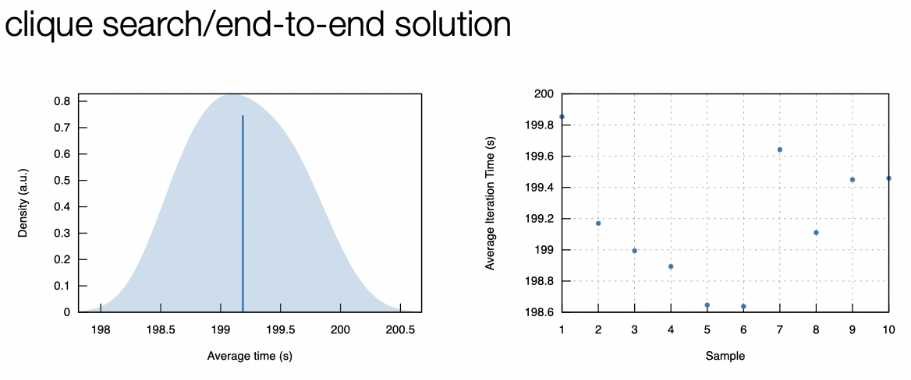
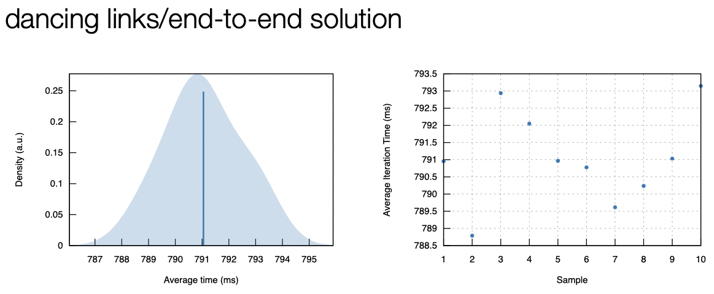
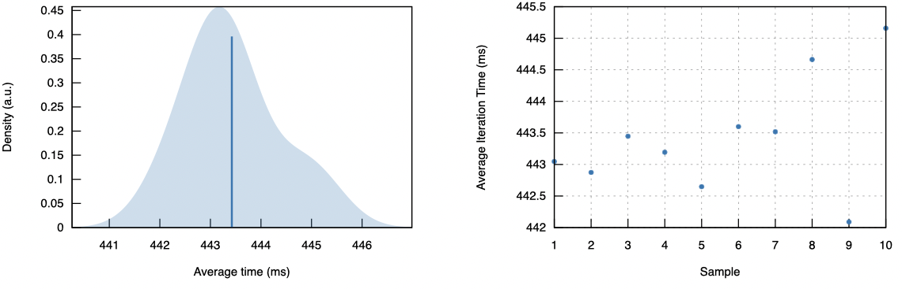
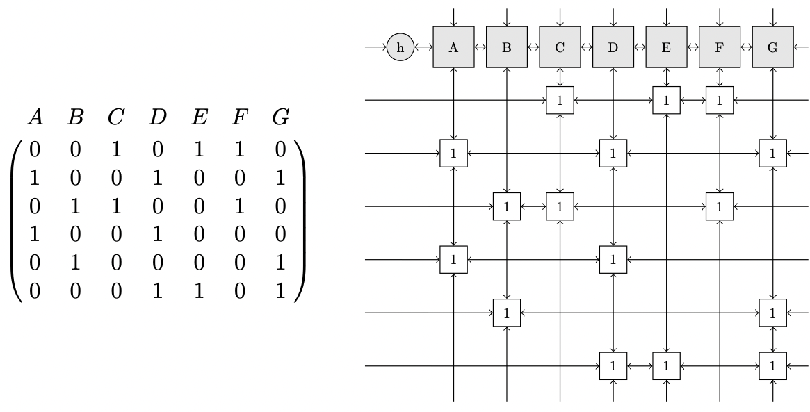

# The Five-Letter Problem in 0.8 Seconds

@davidad, _August 2022_


[Go to **How to Run it**](#how-to-run-it)

## Background

This puzzle was submitted to YouTuber [Matt Parker](https://www.youtube.com/user/standupmaths)'s podcast [A Problem Squared](https://aproblemsquared.libsyn.com/):

> Can you find five five-letter words with twenty-five unique letters?
> - Daniel Bingham

You should watch Matt's [excellent video](https://www.youtube.com/watch?v=_-AfhLQfb6w) about the puzzle, but the gist is that he wrote some code that he knew full well was terribly inefficient, let it run on an old laptop for literally over a month continuously (while he worked on other things), and then got his answers, job done. Then he talked about it on [that podcast](https://aproblemsquared.libsyn.com/038-fldxt-in-wordle-and-improv-tact-hurdle), and then Benjamin Paassen built an [improved algorithm](https://gitlab.com/bpaassen/five_clique/-/tree/main/) which brought the running time down to just a little over 15 minutes.

### A Challenge!

Although a great improvement, Paassen's code is still in Python and it's still pretty straightforward. I said to myself, "I wager I can solve this puzzle in 20 seconds". This is what I call a fun Friday night activity.

## Contributions

I have a newer laptop, so I also clocked the performance of Paassen's original Python code on my machine: it's about **14m16s**, so only a small improvement from hardware alone.

### Rewrite It In Rust

I took Paassen's exact algorithmic strategy and implemented it in a performant manner, in Rust. The runtime of that strategy is just a hair under 200 seconds, or **3m20s**:


### Dancing Links

But then I pulled out my copy of [Volume 4B, Fascicle 5](https://blackwells.co.uk/bookshop/product/The-Art-of-Computer-Programming-Volume-4B-Fascicle-5-Mathematical-Preliminaries-Redux-Backtracking-Dancing-Links-by-Donald-Ervin-Knuth/9780134671796) of [Donald Knuth](https://en.wikipedia.org/wiki/Donald_Knuth)'s [The Art of Computer Programming](https://en.wikipedia.org/wiki/The_Art_of_Computer_Programming) and implemented [Knuth's Algorithm X](https://en.wikipedia.org/wiki/Knuth%27s_Algorithm_X) (that's its actual name!) with his [Dancing Links](https://en.wikipedia.org/wiki/Dancing_Links) optimizations.

Using Algorithm X, the entire solution benchmarks under **0.795 s** single-threaded:



I haven't worked out a great way to parallelize this yet, but over on the [par branch](https://github.com/davidad/five-letters/tree/par) I have a version that gets down under **0.45 s** multi-threaded:



## How does it work?

I encourage you to read Knuth's own explanation, but here's a brief summary. Dancing Links is a way of making backtracking deletions from lists really efficient, by using doubly-linked lists and exploiting the fact that "undeletions" can be guaranteed to happen in exactly the reverse order from deletions. Algorithm X uses one horizontal doubly-linked list (to tie together, in this case, the letters that are still available) and for each letter, one vertical doubly-linked list (to tie together all the words that would use that letter):



_image credit: "[Solving Sudoku efficiently with Dancing Links](https://www.kth.se/social/files/58861771f276547fe1dbf8d1/HLaestanderMHarrysson_dkand14.pdf)", Harrysson and Laestander, 2014_

The backtracking search proceeds by identifying the column with the fewest intersecting rows, then trying each row in turn, deleting that row and also deleting all columns that row touches, and recursively searching for new steps until all columns are deleted (at which point a solution to the exact-cover problem is found).

### But this isn't an exact cover problem

That's right, we're looking for an *almost*-exact cover, and Algorithm X really takes advantage of the symmetries involved in seeking an exact cover. So I modified the problem spec slightly, including an "appendix" of all 26 one-letter words, and adding a special case in Algorithm X that if the algorithm chooses to make use of any of the words from the appednix, the entire appendix of one-letter words is immediately deleted (and then later undeleted in reverse order, of course, if that choice is backtracked).

## Why is it fast?

* After initialization, the solution algorithm performs no heap allocations.
* Everything stays in CPU cache. The state of the dancing links algorithm ranges from 140kB to 367kB, depending on parameters (like whether to keep anagrams, and which word list to use).
* The algorithm is very aggressive about pruning.
* The heuristic of always branching only on the columns with the fewest nodes keeps the search tree dramatically smaller.
* Knuth is a genius and his optimizations are really good.
* Zero-overhead abstraction with Rust.

## How to run it

Clone the repository, make sure you have a [rust toolchain](https://rustup.rs) installed, do `cargo build release`, and then here are some fun invocations:

```
davidad@locus five-letters $ time ./target/release/five-letters | wc -l
100%|██████████| 5977/5977 [00:00<00:00, 8146293.00it/s]
Heap size of dancing links: 215760 bytes.

100%|██████████| 92/92 [00:00<00:00, 293.35it/s]

     538
        0.81 real         0.80 user         0.00 sys
```

(The above reproduces Matt Parker's headline number:)


```
davidad@locus five-letters $ time ./target/release/five-letters --keep-anagrams | wc -l
100%|██████████| 10175/10175 [00:00<00:00, 8139733.50it/s]
Heap size of dancing links: 366888 bytes.

100%|██████████| 110/110 [00:00<00:00, 170.27it/s]

     831
        1.69 real         1.68 user         0.00 sys
```

(The above reproduces the number from Benjamin Paassen's code.)

```
davidad@locus five-letters $ time ./target/release/five-letters --intersect-with words_wordle.txt
100%|███████████| 3806/3806 [00:00<00:00, 8336601.00it/s]
Heap size of dancing links: 137604 bytes.

100%|███████████| 57/57 [00:00<00:00, 911.73it/s]

fjord	waltz	vibex	gucks	nymph
        0.40 real         0.19 user         0.00 sys
```

(The above reproduces Matt Parker's sole solution that intersects with the wordle guess list:)


```
davidad@locus five-letters $ time ./target/release/five-letters -f words_wordle.txt --keep-anagrams
100%|███████████| 8324/8324 [00:00<00:00, 6707721.00it/s]
Heap size of dancing links: 300252 bytes.

100%|███████████| 94/94 [00:00<00:00, 226.28it/s]

waqfs	jumby	vozhd	glent	prick
waqfs	jumby	vozhd	kreng	clipt
waqfs	jumby	vozhd	pling	treck
waqfs	jumpy	vozhd	bling	treck
waqfs	jumpy	vozhd	brick	glent
waqfs	vozhd	bemix	grypt	clunk
waqfs	vozhd	cimex	blunk	grypt
waqfs	vozhd	cylix	kempt	brung
waqfs	vozhd	xylic	kempt	brung
fjord	vibex	waltz	gucks	nymph
fjord	vibex	waltz	gymps	chunk
        0.89 real         0.89 user         0.00 sys
```

Finally, here we answer a question not addressed in the video: what if we analyze only the Wordle guess list, without reference to `words_alpha.txt`? It turns out the Wordle list has some that the latter doesn't, such as `waqfs`, `gymps`, `vozhd`, `brung`, and `grypt`, making several more solutions possible. But I still think there's no doubt that `fjord	vibex	waltz	gucks	nymph` is the best solution, so nothing groundbreaking here! (I tried it with the official Scrabble word list and got the exact same result, so presumably that had some influence on Wordle's list of 5-letter words.)
